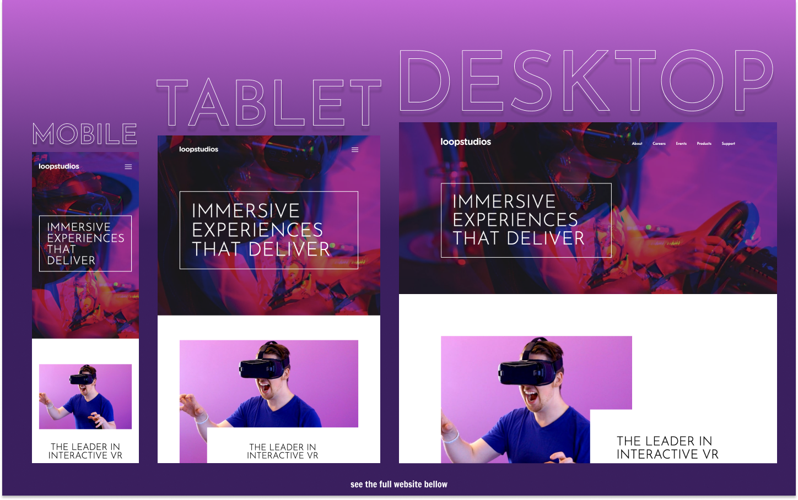

# Frontend Mentor - Loopstudios Landing Page Solution

This is a solution to the [Loopstudios Landing Page Challenge on Frontend Mentor](https://www.frontendmentor.io/challenges/loopstudios-landing-page-N88J5Onjw).

## Table of contents

- [Overview](#overview)
  - [The challenge](#the-challenge)
  - [Screenshot](#screenshot)
  - [Links](#links)
- [My process](#my-process)
  - [Built with](#built-with)
  - [What I learned](#what-i-learned)
- [Author](#author)

## Overview

### The challenge

Users should be able to:

- View the optimal layout for the site depending on their device's screen size
- See hover states for all interactive elements on the page

### Screenshot

### Links

- Live Site URL: [https://kens-visuals.github.io/loopstudios-landing-page/](https://kens-visuals.github.io/loopstudios-landing-page/)
- Solution URL: [https://www.frontendmentor.io/solutions/loopstudios-landing-page-with-vanilla-js-scss-and-bem-RUVC6Bett](https://www.frontendmentor.io/solutions/loopstudios-landing-page-with-vanilla-js-scss-and-bem-RUVC6Bett)

## My process

### Built with

- Semantic HTML5 markup
- SCSS custom properties
- CSS Flexbox
- CSS Grid
- Vanilla JS
- Mobile-first workflow

### What I learned

I really enjoyed this one, because it was a mix of a lot of things with some small, but nice challenges along the way. I also liked the modern and clean look of the design. Not cluttered, straight to the point. I've realized that these challenges not only help me to practice HTML/CSS/JS skills, but also train my eye for some good design. Because as a front-end developer, you need to have some basic understanding of UI/UX design. In brief, I achieved all the goals within the project, provided by Frontend Mentor and also the ones that I came up with. On to the next one!!!

## Author

- Frontend Mentor - [@kens-visuals](https://www.frontendmentor.io/profile/kens-visuals)
- Codewars - [@kens_visuals](https://www.codewars.com/users/kens_visuals)
- CodePen - [@kens-visuals](https://codepen.io/kens-visuals)
